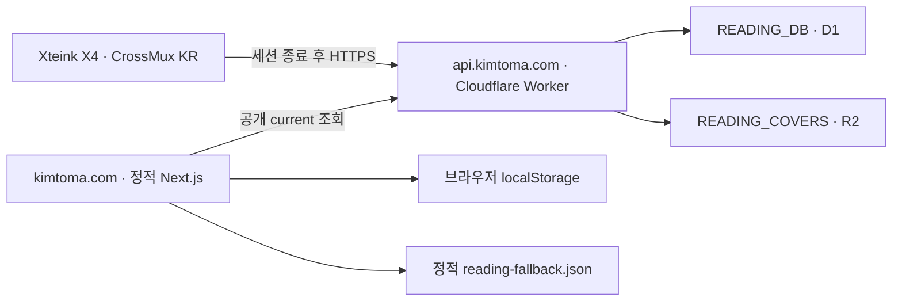

# CrossMux KR × kimtoma.com 독서 현황 연동 설계

**날짜:** 2026-07-17
**상태:** 승인된 내용을 문서화함 · 사용자 문서 검토 대기
**펌웨어 기준:** `ryokun6/crossmux` `main`의 `gh_release_ko` 환경
**웹 기준:** `kimtoma/kimtoma.com` `main`

## 1. 목표

Xteink X4에서 한국어 책을 편하게 읽을 수 있는 읽기 중심 펌웨어 `CrossMux KR`을 만들고, 유효한 독서 세션이 끝날 때 최신 책·진행률·표지를 `kimtoma.com`에 자동 반영한다.

핵심 결과는 다음 네 가지다.

1. 작은 글자 크기에서도 일반적인 한국어 책 제목과 본문을 읽을 수 있다.
2. 독서 기록은 항상 기기에 먼저 저장되며, 네트워크 실패가 독서를 방해하지 않는다.
3. `kimtoma.com`의 목록 보기와 위젯 보기가 같은 최신 독서 데이터를 표시한다.
4. API가 중단되어도 브라우저 캐시와 정적 기본값 순서로 조용히 폴백한다.

## 2. 기준 저장소와 계보

코드 계보는 다음과 같이 본다.

1. 최초 기반: [`crosspoint-reader/crosspoint-reader`](https://github.com/crosspoint-reader/crosspoint-reader)
2. 읽기 중심 포크: [`0x1abin/crossmux`](https://github.com/0x1abin/crossmux)
3. 한국어 빌드와 현재 개선의 기준: [`ryokun6/crossmux`](https://github.com/ryokun6/crossmux)

구현 기준은 세 번째 저장소의 `main`이다. 이 저장소에는 이미 한국어 릴리스 환경과 `firmware-ko.bin` OTA 선택 로직이 있다(`platformio.ini:234-250`, `src/network/OtaUpdater.cpp:20-34`). 한국어 작업은 별도 제품을 처음부터 만드는 대신 이 SKU를 읽기 중심으로 다듬는다.

2026-07-17 기준으로 아래 두 변경은 아직 열린 PR이므로, 구현 시점의 최신 커밋과 충돌을 다시 확인한 뒤 재현 또는 통합한다.

- [PR #18 — KS X 1001 기반 한국어 소형 글꼴 확장](https://github.com/ryokun6/crossmux/pull/18)
- [PR #19 — CJK 원문 공백 보존](https://github.com/ryokun6/crossmux/pull/19)

## 3. 전체 구조



데이터 흐름은 아래 순서를 지켜야 한다.

1. 리더가 기존 `ReadingStatsStore`에 로컬 통계를 저장한다.
2. 그 저장이 성공한 뒤 공개 가능한 최소 메타데이터를 SD 카드 동기화 큐에 원자적으로 기록한다.
3. 홈 화면 전환 후 백그라운드 동기화가 시작된다. Wi-Fi/API 실패는 큐만 남기고 종료한다.
4. Worker는 인증·순서를 검증하고 D1의 최신 읽기 상태를 갱신한다. 표지는 별도 요청으로 R2에 저장한다.
5. 사이트는 공개 API, 브라우저의 마지막 성공값, 정적 기본값 순서로 하나를 선택한다.

## 4. 저장소별 책임

| 영역 | 소유 저장소 | 책임 |
| --- | --- | --- |
| 한국어 글꼴·EPUB 공백 | `ryokun6/crossmux` 기반 CrossMux KR | 8/10/12pt 한국어 범위, 14pt 전체 현대 한글, 캐시 버전 |
| 세션 판정·로컬 큐·HTTPS | CrossMux KR | 로컬 우선 저장, 순서 번호, 재시도, 토큰, 표지 추출 |
| 기기 인증·멱등 처리 | `kimtoma.com/workers/gemini-proxy` | 토큰 해시, sequence 판정, 입력 검증 |
| 최신 상태·표지 보관 | `READING_DB` D1, `READING_COVERS` R2 | 이벤트와 current, 콘텐츠 주소형 표지 |
| 목록·위젯·폴백 | `kimtoma.com` | 단일 Provider, 동일 데이터 표시, 조용한 폴백 |
| 발급·회전·상태 확인 | `kimtoma.com`의 로컬 운영 스크립트 | 공개 관리 화면 없이 1대의 X4 운영 |

세부 설계는 다음 문서에 있다.

- [CrossMux KR 펌웨어 설계](./2026-07-17-crossmux-kr-firmware-design.md)
- [`kimtoma.com` Live Reading 플랫폼 설계](https://github.com/kimtoma/kimtoma.com/blob/main/docs/superpowers/specs/2026-07-17-live-reading-platform-design.md)

## 5. 교차 저장소 계약

### 5.1 API 기준 주소

펌웨어에 고정하는 기준 주소는 `https://api.kimtoma.com/v1/reading`이다. 사용 엔드포인트는 다음과 같다.

| 메서드·경로 | 공개 여부 | 목적 |
| --- | --- | --- |
| `POST /v1/reading/sync` | 기기 토큰 필요 | 최신 메타데이터 반영, 연결 테스트의 `validateOnly=1` 포함 |
| `PUT /v1/reading/books/{bookId}/cover` | 기기 토큰 필요 | 원본 JPG/PNG 표지 업로드 |
| `GET /v1/reading/current` | 공개 | 사이트가 읽을 5개 필드 반환 |
| `GET /v1/reading/covers/{sha256}` | 공개 | 콘텐츠 주소형 표지 반환 |

### 5.2 기기에서 보내는 필드

```json
{
  "schemaVersion": 1,
  "sequence": 42,
  "bookId": "32-character-content-id",
  "title": "B밀의 숲",
  "author": "김형석",
  "progressPercent": 37,
  "lastReadAt": "2026-07-17T12:34:56Z",
  "isbn13": null,
  "coverSha256": "optional-lowercase-hex",
  "coverMime": "image/jpeg"
}
```

필수 필드는 `schemaVersion`, `sequence`, `bookId`, `title`, `author`, `progressPercent`다. 나머지는 알 수 있을 때만 보낸다. 파일 경로, 장 제목, 세션 시간은 기기 밖으로 보내지 않는다.

### 5.3 사이트에 공개하는 필드

`GET /v1/reading/current`의 성공 응답은 아래 다섯 필드만 갖는다.

```json
{
  "title": "B밀의 숲",
  "author": "김형석",
  "progressPercent": 37,
  "lastSyncedAt": "2026-07-17T12:35:08Z",
  "coverUrl": "https://api.kimtoma.com/v1/reading/covers/abc123..."
}
```

`isbn13`, `bookId`, 기기 ID, 이벤트 ID, 외부 서점 URL은 공개 응답에 포함하지 않는다. `coverUrl`은 표지가 없으면 `null`이다.

### 5.4 순서와 멱등성

- `sequence`는 기기에 영속되는 1 이상의 32비트 부호 없는 정수다.
- 서버의 마지막 sequence보다 크면 `accepted`, 같으면 `duplicate`, 작으면 `stale`다.
- 세 상태는 모두 HTTP 200이며, 펌웨어는 메타데이터 큐를 삭제할 수 있다.
- 모든 응답은 서버가 확정한 `lastAcceptedSequence`를 포함한다. stale를 받은 기기는 로컬 `nextSequence`를 최소 `lastAcceptedSequence + 1`로 전진시킨다.
- sequence 간격은 허용한다. 로컬 큐가 이전 미전송 스냅샷을 더 최신 값으로 합칠 때 간격이 생길 수 있다.
- `coverRequired`는 메타데이터 성공과 독립적으로 판단한다. 표지 실패는 current 갱신을 되돌리지 않는다.

## 6. 보안·개인정보 경계

- X4 전용 256비트 불투명 토큰을 사용하며 다른 계정 비밀번호나 ryOS 자격 증명을 재사용하지 않는다.
- 기기에는 MAC 기반 XOR 난독화 후 저장한다. 이는 암호화가 아니며 문서와 UI에서도 난독화라고 표기한다.
- 서버에는 원문 토큰이 아니라 SHA-256 해시만 저장한다.
- 토큰은 기기 설정 API의 GET 응답, 로그, 내보내기 파일에 절대 포함하지 않는다.
- 공개 읽기 API에는 위의 다섯 필드만 허용한다.
- 쓰기 엔드포인트에는 와일드카드 브라우저 CORS를 부여하지 않는다.
- 표지는 최대 2MB의 JPG 또는 PNG만 허용하고 실제 본문 해시와 MIME을 검증한다.

## 7. 사이트 폴백 계약

사이트의 우선순위는 고정한다.

1. `GET /v1/reading/current`의 유효한 성공 응답
2. `localStorage`의 `kimtoma:reading:v1` 마지막 성공값
3. 빌드에 포함된 `content/reading-fallback.json`

정적 기본값은 현재 수동 기록의 최신값인 `B밀의 숲` / `김형석`으로 한 번 초기화하고, 진행률·표지·동기화 시각은 `null`로 둔다. 자동 연동이 시작된 뒤 Obsidian `Now Log.md`의 Reading 행은 데이터 원본이 아니다. 다른 NOW.LOG 행은 계속 기존 소스를 따른다.

API 오류, 캐시 사용, 정적 기본값 사용 때문에 별도 오류 배너를 띄우지 않는다. 대신 각각 `N분 전 동기화`, `최근 기록`, `기록 준비 중`이라는 짧은 상태만 표시한다. 오래된 라이브 데이터도 나이만으로 숨기지 않는다.

## 8. 배포 순서

각 단계는 앞 단계가 검증된 뒤 진행한다.

1. Worker에 `READING_DB`, `READING_COVERS`, 읽기 라우트를 추가한다. current가 없으면 404를 반환한다.
2. 사이트에 공용 `ReadingProvider`와 3단계 폴백을 배포한다. 이 시점에는 정적 기본값이 보인다.
3. 운영 스크립트로 X4 토큰을 발급하고 웹 설정에 입력한 뒤 CrossMux KR을 설치한다.
4. 실제 책에서 조건을 만족하는 독서 세션을 한 번 종료한다.
5. D1 current, R2 표지, 공개 current, 목록 보기, 위젯 보기를 차례로 확인한다.
6. 전체 경로가 확인된 뒤에만 수동 Reading 행 갱신을 중단한다.

기존 Worker의 Chat, Spotify, Strava 엔드포인트 회귀 검증을 1단계 배포 조건에 포함한다.

## 9. 장애와 롤백

| 장애 | 사용자에게 보이는 결과 | 운영 조치 |
| --- | --- | --- |
| X4가 오프라인 | 마지막 사이트 값 또는 폴백 유지 | 다음 부팅/세션 종료 때 큐 재시도 |
| 토큰 폐기·오류 | 펌웨어 큐 유지, 자동 쓰기 일시 정지 | 토큰 회전 후 X4 설정 갱신 |
| Worker/D1 장애 | 사이트가 브라우저 캐시 또는 정적값 사용 | Worker 롤백 또는 복구 |
| R2/표지 오류 | 제목·저자·진행률은 정상, 아이콘 표지 | 표지 큐 재시도·R2 상태 확인 |
| 사이트 새 코드 오류 | 정적 배포를 이전 버전으로 롤백 | 읽기 API와 기기 큐는 계속 독립 동작 |
| 펌웨어 동기화 오류 | 로컬 독서 통계는 보존 | 동기화 기능 비활성 빌드 또는 이전 OTA |

읽기 라우트와 D1/R2 바인딩은 기존 서비스에 추가하는 방식이므로, 롤백 시 Chat/Spotify/Strava 스키마를 되돌리지 않는다.

## 10. 완료 기준

- KS X 1001 공통 한글 음절 범위의 임의 제목이 8/10/12pt에서 깨지지 않는다.
- 한국어 EPUB의 원문 단어 사이 공백이 레이아웃에 보존된다.
- 세션 종료 시 로컬 통계 저장이 네트워크보다 먼저 완료되며 실패해도 손실되지 않는다.
- 조건을 만족한 최신 책과 진행률이 사이트 다음 로드 또는 최대 60초 폴링 후 표시된다.
- 목록 보기와 위젯 보기가 같은 제목·저자·진행률·동기화 시각·표지를 표시한다.
- 네트워크·인증·중복·stale·표지 실패 시나리오가 정의된 폴백/큐 규칙대로 동작한다.
- 한국어 OTA 바이너리가 6,553,600바이트 슬롯에서 최소 512KiB, 목표 640KiB의 여유를 확보한다.
- 실제 X4 동기화 전후 free heap이 50KB를 넘고 반복 동기화에서 누수가 없다.
- 토큰이나 비공개 필드가 로그·공개 응답·설정 조회에 노출되지 않는다.

## 11. 자체 검토 결과

문서 작성 후 펌웨어·API·사이트 계약을 다음 기준으로 교차 검토했다.

| 검토 항목 | 결과 |
| --- | --- |
| 누락·임시 결정 | 필수 endpoint, payload, D1/R2, 폴백, 배포, 롤백, 검증, 비목표가 모두 문서화됨 |
| 수치 일치 | 3분/1%p, Wi-Fi 8초, HTTPS 15초, JSON 8KB, 표지 2MB, 사이트 5초/60초, OTA 512/640KiB가 세 문서에서 충돌하지 않음 |
| sequence 복구 | stale 반복 위험을 발견해 `lastAcceptedSequence` 응답과 기기 전진 규칙을 추가함 |
| 동시 요청 | 낮은 sequence의 역전 위험을 발견해 D1 compare-and-set `writeId` batch 규칙을 추가함 |
| 표지 독립성 | R2 head/PUT 실패가 metadata current를 막지 않도록 D1 `cover_key` 연결과 재시도 규칙을 분리함 |
| 인증 테스트 | 별도 관리 endpoint를 늘리지 않고 기존 sync의 `validateOnly=1` 비변경 경로로 고정함 |
| CORS·오류 노출 | reading prefix가 기존 wildcard preflight/global error로 빠지지 않도록 전용 router 경계를 명시함 |
| 범위 팽창 | 다중 사용자, 공개 이력, ISBN 보강, 사이트 전면 리팩터는 v1에서 제외함 |

설계 결정으로 남은 열린 항목은 없다. 다만 다음은 구현 결과로 통과해야 하는 검증 게이트다.

- PR #18/#19가 구현 시작 시점의 `main`과 달라졌는지 재확인
- KO source 제외 후 실제 `.map`과 바이너리로 512/640KiB 여유 확인
- 실제 X4에서 TLS 중 heap 50KB와 8초/15초 timeout 적정성 확인
- 실제 Cloudflare D1/R2에서 batch·CORS·cache header와 기존 서비스 회귀 확인

## 12. 비목표

- 여러 사용자·여러 활성 기기 지원
- 독서 이력 페이지, 통계 대시보드, 소셜 공유
- ISBN/서점 API를 통한 자동 보강을 v1 성공 조건으로 삼는 것
- EPUB 이외 형식에서 원본 표지를 복원하는 것
- 공개 관리 화면 또는 브라우저에서의 토큰 관리
- 기존 사이트 전체 NOW.LOG 데이터 구조 리팩터
